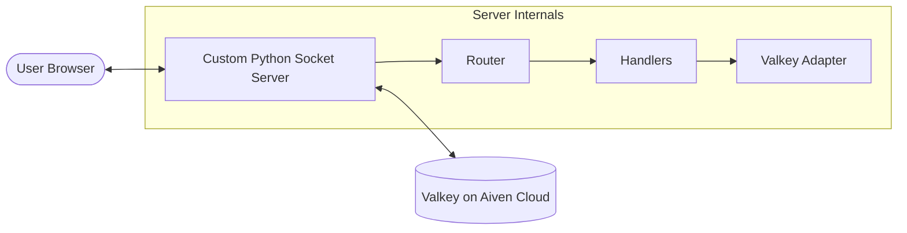
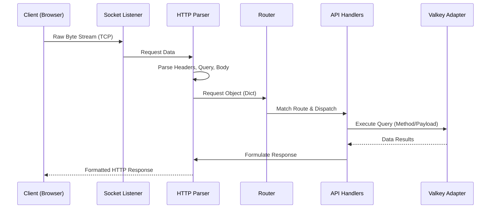
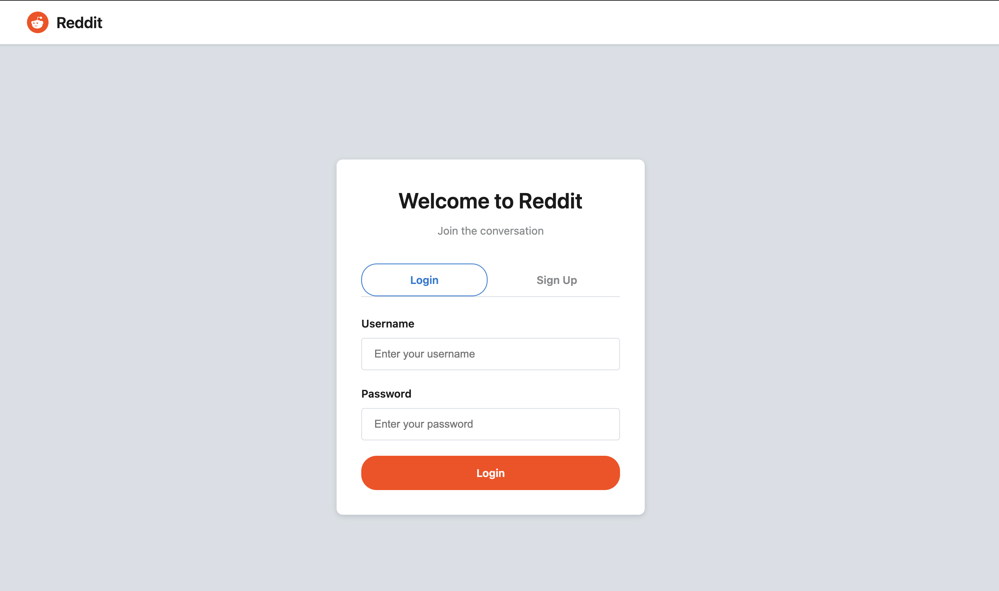
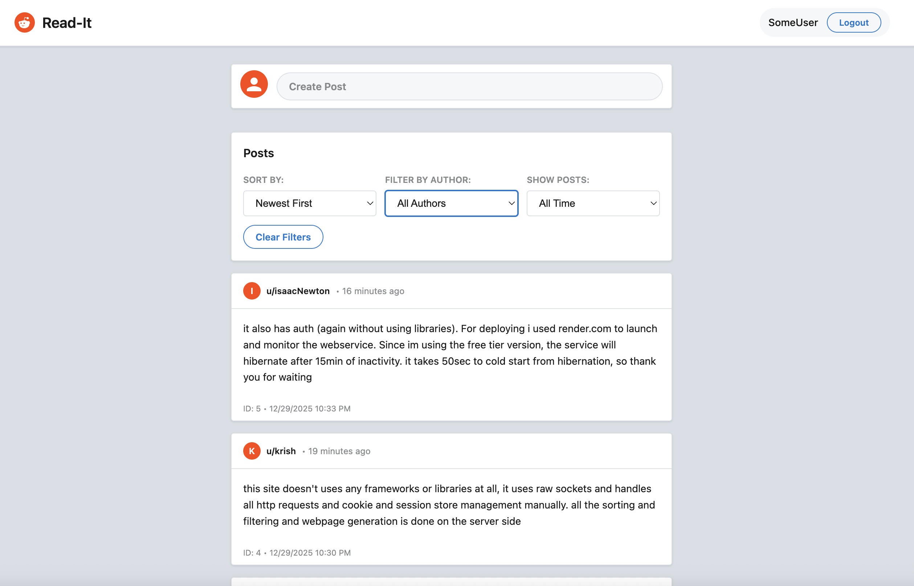
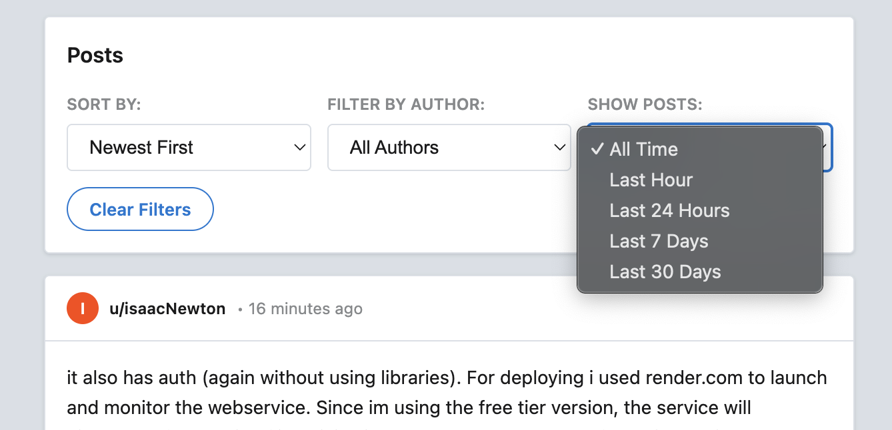

# [Read-it](https://read-it-2mf8.onrender.com/)
*Custom Socket-Based Web Framework & Discussion Forum App*

A from-scratch implementation of a multi-threaded web server and application, built using only the Python `socket` library to demystify the inner workings of modern backend frameworks like Flask and FastAPI.

## Project Goal

The primary objective of this project was to go "under the hood" of web development. Instead of relying on high-level frameworks, I built everything from the ground up to truly understand:
- How **TCP sockets** handle raw HTTP traffic.
- Implementation of the **HTTP/1.1 protocol** (parsing and formatting).
- **Concurrent request handling** using multi-threading.
- **State management** using custom sessions, cookies, and a persistent cache store.

---

## High-Level System Design

This project follows a classic client-server architecture, but with every layer implemented manually.



---

## Internal Data Flow

To recreate the behavior of a backend framework, I implemented a pipeline that transforms raw bytes into structured data and back.



---

## Features & Architecture

### 1. Custom HTTP Stack
I bypassed `WSGI` and `ASGI` entirely. The server listens on a TCP port and manually parses the incoming byte stream into standard HTTP components (Method, Path, Headers, Query Parameters, and Body). This ensures a deep understanding of how `Content-Length`, `MIME-types`, and `Keep-Alive` work.

### 2. Client-Side Rendering (Dynamic SPA)
Unlike traditional static sites, this application acts as a **Single Page Application (SPA)**:
- **XHR & JSON**: The frontend uses `XMLHttpRequest` (XHR) to communicate with the server via `application/json` messages.
- **Dynamic DOM**: Instead of reloading the page, the JavaScript receives JSON data and dynamically updates the DOM, handling state changes for login, registration, and live forum updates.
- **Micro-Framework Style**: I implemented a basic client-side router and state manager to replicate how frameworks like React or Vue handle view updates without a library.

### 3. Multi-threaded Concurrency
To support multiple users simultaneously, the server spawns a new thread for every incoming connection. This prevents blocking and allows the messenger app to be responsive even under load.

### 3. Hand-rolled Authentication & Sessions
- **Session IDs**: Securely generated server-side using `secrets`.
- **Cookie Generation**: Custom `Set-Cookie` header generation with `HttpOnly`, `Path`, and `Max-Age` attributes.
- **Persistent State**: Since the server is multi-threaded, I implemented thread-safe session management using global locks and a centralized storage adapter.

### 4. Valkey Cache (Aiven Cloud)
For persistent data (users and messages), the server uses a **Valkey** (Redis-compatible) cache store hosted on **Aiven Cloud**. I wrote a dedicated adapter that translates "Database-like" queries into Valkey commands (Hashes and Sorted Sets), ensuring fast lookups and persistent storage across server restarts.

*Pls Note: The database is running on a free instance, so it might go into sleep after inactivity. The webserver will handle this gracefully, but the deployed demo may occasionally return an error code if the instance is waking up*

---

## Screenshots

*Screen to login and Register*


*Discussion forum screen*


*Server side sorting and filtering features*


---

## Technology Stack

| Category | Technology |
| :--- | :--- |
| **Core** | Python 3 |
| **Networking** | `socket`, `threading` |
| **Data Store** | Valkey (via Aiven Cloud) |
| **Security** | `secrets`, `re` (Regex for injection protection) |
| **Deployment** | Render.com |

---

## How to Deploy

### Local Setup
1. **Clone the repo**
2. **Setup Valkey**: Ensure you have a Valkey or Redis instance running.
3. **Configuration**: Create a `.env` file based on `.env.example`.
   ```env
   VALKEY_URL=redis://localhost:6379
   PORT=8080
   ```
4. **Run the server**:
   ```bash
   python main.py
   ```

### Cloud Deployment
1. Link your GitHub repository to Render.
2. Create a **Web Service** on **Render.com** for the backend.
3. Create a **Valkey** instance on **Aiven Cloud** and copy the Connection URI.
4. Add the connection URI to Render's environment variables as `VALKEY_URL`.

---

## What I Learned as a Student

This project was a wild ride! Here are some fun takeaways:
- **Frameworks are Magic (but not really)**: Realizing that Flask is basically just a very sophisticated socket loop with a bunch of dictionaries made me feel way more powerful.
- **RegEx is my best friend**: Parsing forms and cookies manually turned me into a RegEx wizard (or at least a very tired apprentice).
- **Concurrency is hard**: Learning about threading and locks the hard way (through race conditions) was a great lesson in "debugging with your ears" (trying to hear why the laptop fan is spinning).
- **Render is awesome**: Deploying a non-standard app (no Gunicorn/Uvicorn) forced me to really understand how environmental configs and ports are mapped in the cloud.

---
*Created with ❤️ by a student curious about how the web actually works.*
